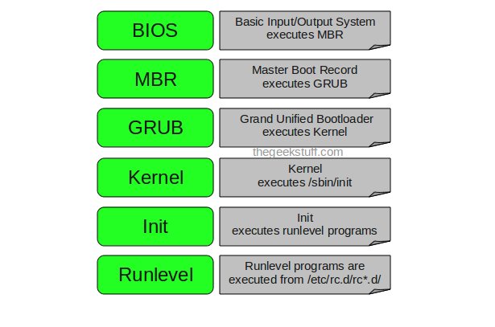
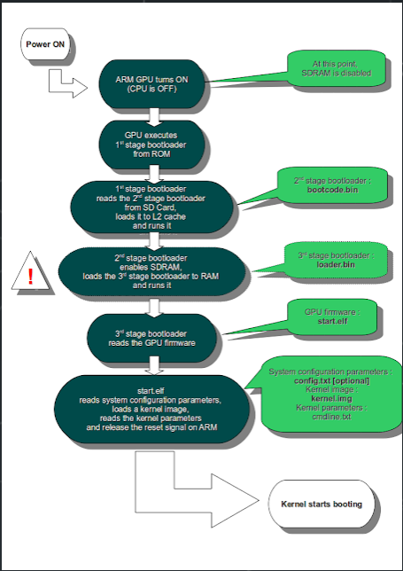
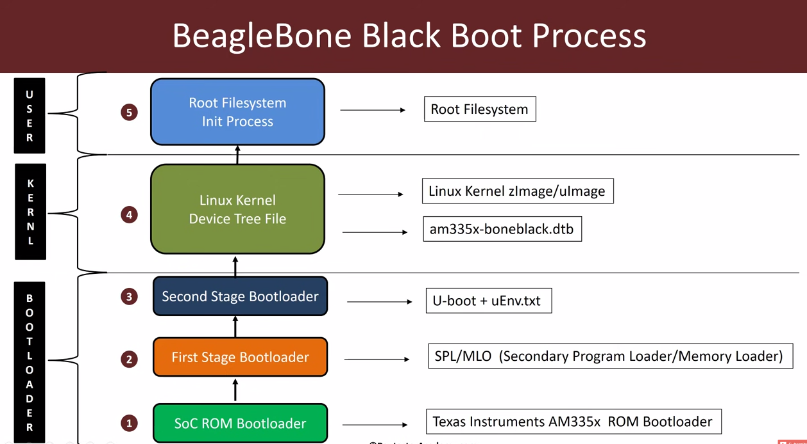
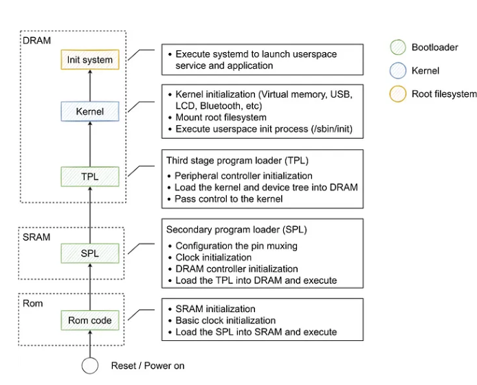

# 2.Bootloaders

The bootloader is the second element of embedded Linux(starts the system and loads the operating system kernel).
## required packages:
device-tree-compiler, git, make, patch, and u-boot-tools 

```shell

$ sudo apt-get install device-tree-compiler git make patch u-boot-tools 

```

## The boot sequence:
## 1.PC
### 1.BIOS:
Performs integrity checks on the HDD/SSD.
Searches for, loads, and executes the boot loader program from the Master Boot Record (MBR).
Gives control of the system to the boot loader.
### 2.MBR (Master Boot Record):
Located in the 1st sector of the bootable disk.
Responsible for loading and executing the GRUB boot loader.
Contains information about GRUB or LILO (in older systems).
### 3.GRUB (GNU GRand Unified Bootloader):
The typical boot loader for modern Linux systems.
Displays a splash screen with a menu for selecting boot options.
Loads and executes the selected kernel image.
Uses the grub.conf (or grub.cfg) configuration file.
### 4.Kernel:
The core of the operating system.
Mounts the root file system specified in the grub.conf file.
Executes the /sbin/init program (PID 1).
Establishes a temporary root file system using initrd (Initial RAM Disk).
### 5.Init:
Executes runlevel programs based on the chosen run level.
Historic systems use /etc/inittab, while modern systems use systemd.
	Run level 0 is matched by poweroff.target (and runlevel0.target is a symbolic link to poweroff.target).
	Run level 1 is matched by rescue.target (and runlevel1.target is a symbolic link to rescue.target).
	Run level 3 is emulated by multi-user.target (and runlevel3.target is a symbolic link to multi-user.target).
	Run level 5 is emulated by graphical.target (and runlevel5.target is a symbolic link to graphical.target).
	Run level 6 is emulated by reboot.target (and runlevel6.target is a symbolic link to reboot.target).
	Emergency is matched by emergency.target.
### 6.Runlevel Programs:
Different services start depending on the run level.
Located in directories specific to each run level.
Programs starting with "S" or "K" for startup and kill, respectively.
These are known as runlevel programs, and are executed from different directories depending on your run level.
Each of the 6 runlevels described above has its own directory:
	Run level 0 – /etc/rc0.d/
	Run level 1 – /etc/rc1.d/
	Run level 2  – /etc/rc2.d/
	Run level 3  – /etc/rc3.d/
	Run level 4 – /etc/rc4.d/
	Run level 5 – /etc/rc5.d/
	Run level 6 – /etc/rc6.d/

-


## The raspberry pi boot sequence:

1. BCM2837 powers on, arm core off, and GPU is on.
2. GPU executes first stage bootloader found in the ROM. The first stage bootloader allows GPU access to SD Card.
3. GPU reads from SD Card loads the second stage bootloader(bootcode.bin) into L2 cache. bootcode.bin enables the SDRAM. 
Afterwards, the GPU reads and executes the GPU firmware(start*.elf files).
4. Start.elf reads kernel.img, config.txt, and cmdline.txt and loads them into memory. The GPU wakes up the ARM CPU.
5. Kernel is booted up.

-

## The beaglebone black boot sequence :

-


## Phases boot sequence inside Bootloaders.

### 1.Phase 1 – ROM code
Phase 1 or ROM code is a crucial part of a chip's start-up process.
It's preloaded during manufacturing and can't be changed. 
This code doesn't handle memory setup but uses a small on-chip memory (SRAM) 
to load a tiny portion of code from preset locations,like specific flash memory pages or files. 
Most SoCs follow a similar process, and if the SRAM is too small for a full bootloader, an interim loader (SPL) steps in.
### At the end of the ROM code phase, the SPL is present in the SRAM and the ROM code jumps to the beginning of that code.

### 2.Phase 2 – secondary program loader
Phase 2, also known as the secondary program loader (SPL), prepares the system for the next step by setting up 
critical components like the memory controller before loading the Tertiary Program Loader (TPL) into DRAM. 
If the SPL has filesystem drivers built in to it, it can read wellknown filenames, such as u-boot.img from a disk partition.
This phase involves the transition from ROM code to SPL, where the SPL, functioning in SRAM, loads the TPL into DRAM. 
By the end of this phase, the TPL is in DRAM, and the SPL initiates a jump to that area. 
### Phase 3 – TPL
the Tertiary Program Loader (TPL), introduces a full bootloader like U-Boot. It provides a simple command-line interface 
for tasks such as managing boot and kernel images in flash storage and facilitating kernel loading and booting, both manually and automatically.
This phase show the jump from SPL in SRAM to TPL in DRAM .As the TPL executes, it loads the kernel into DRAM. 
At the end of the third phase, there is a kernel in memory, waiting to be started
-


