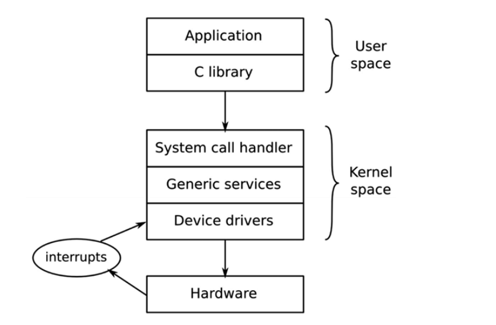
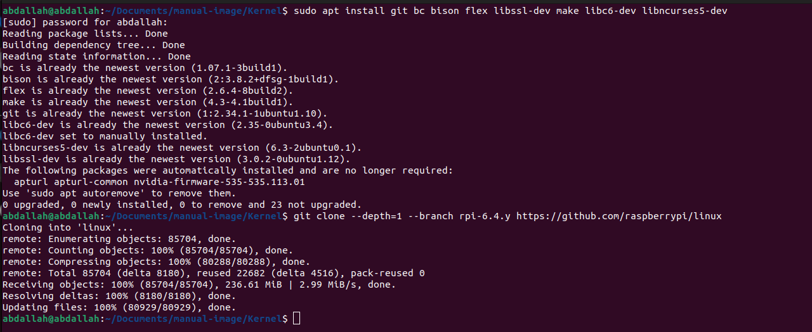
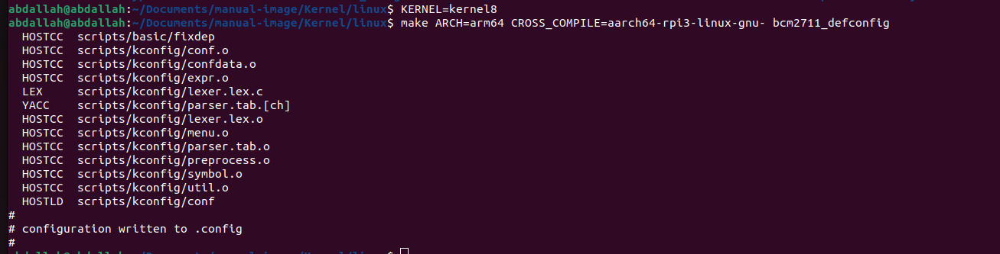
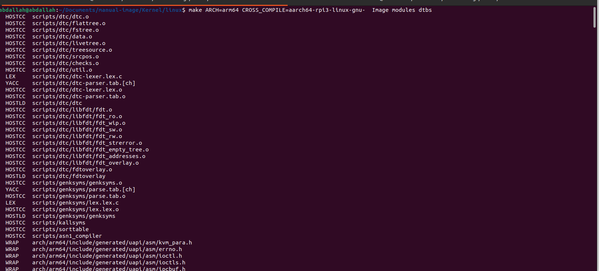
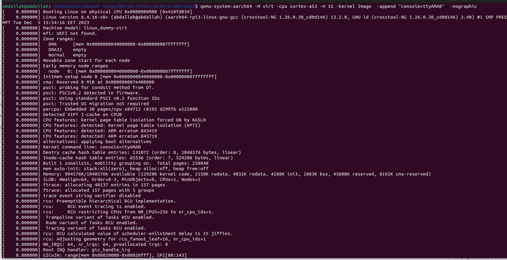
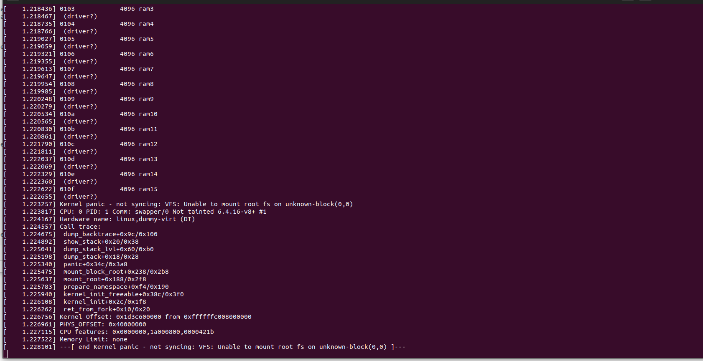

# 3.Kernel


The kernel is responsible for managing resources and interfacing with hardware, 
 
## What does the kernel do?
The kernel has three main jobs: to manage resources, to interface with hardware, and
to provide an API that offers a useful level of abstraction to user space programs.



Applications running in user space run at a low CPU privilege level. They can do very
little other than make library calls. The primary interface between the user space and the
kernel space is the C library, which translates user-level functions, such as those defined
by POSIX, into kernel system calls. The system call interface uses an architecture-specific
method, such as a trap or a software interrupt, to switch the CPU from low-privilege user
mode to high-privilege kernel mode, which allows access to all memory addresses and
CPU registers.

The system call handler dispatches the call to the appropriate kernel subsystem: memory
allocation calls go to the memory manager, filesystem calls to the filesystem code, and so
on. Some of those calls require input from the underlying hardware and will be passed
down to a device driver. In some cases, the hardware itself invokes a kernel function by
raising an interrupt


The kernel serves as the core component of an operating system, responsible for managing system resources and providing essential services to enable communication between hardware and software. Its main usages include:

1. **Hardware Interaction:** The kernel manages communication between hardware components (CPU, memory, storage, etc.) and software applications. It provides a uniform interface for software to access hardware resources.

2. **Memory Management:** Allocating memory, managing virtual memory, and ensuring that different processes and applications run without interfering with each other's memory space.

3. **Process Management:** The kernel schedules processes and threads, allocating CPU time, managing their execution, and ensuring that multiple processes can run concurrently without conflicts.

4. **Device Drivers:** Kernel includes device drivers to enable communication between hardware devices (such as printers, keyboards, and network interfaces) and the rest of the system.

5. **System Calls:** It provides system calls, which are interfaces that allow user-level processes to request services from the kernel, like file system operations, network communication, and more.

6. **File System Management:** The kernel manages file systems, allowing for the creation, deletion, and manipulation of files and directories. It also handles access control and security related to files and directories.

7. **Security:** Implementing security measures like access control, authentication, and protecting the system from unauthorized access or malicious software.

In essence, the kernel acts as a bridge between the hardware and software layers, providing an interface for applications to utilize system resources efficiently and securely.

## Building the Kernel 
### 1.Locally

### First install Git and the build dependencies:

```shell
sudo apt install git bc bison flex libssl-dev make
```

### Next get the sources, which will take some time:

```shell
git clone --depth=1 https://github.com/raspberrypi/linux
```
### Choosing Sources
The git clone command above will download the current active branch (the one we are building Raspberry Pi OS images from) without any history. Omitting the --depth=1 will download the entire repository, including the full history of all branches, but this takes much longer and occupies much more storage.

To download a different branch (again with no history), use the --branch option:

```shell
git clone --depth=1 --branch rpi-6.4.y https://github.com/raspberrypi/linux
```
where <branch> is the name of the branch that you wish to download.

Refer to the original GitHub repository for information about the available branches.

### Kernel Configuration
Configure the kernel; as well as the default configuration, you may wish to configure your kernel in more detail or apply patches from another source, to add or remove required functionality.

### Apply the Default Configuration
First, prepare the default configuration by running the following commands, depending on your Raspberry Pi model:

For Raspberry Pi 3, 3+, 4, 400 and Zero 2 W, and Raspberry Pi Compute Modules 3, 3+ and 4 default 64-bit build configuration
```shell
cd linux
KERNEL=kernel8
make bcm2711_defconfig
```
### Building the Kernel
Build and install the kernel, modules, and Device Tree blobs; this step can take a long time depending on the Raspberry Pi model in use. For the 32-bit kernel:

```shell
make -j4 zImage modules dtbs
sudo make modules_install
sudo cp arch/arm/boot/dts/*.dtb /boot/firmware/
sudo cp arch/arm/boot/dts/overlays/*.dtb* /boot/firmware/overlays/
sudo cp arch/arm/boot/dts/overlays/README /boot/firmware/overlays/
sudo cp arch/arm/boot/zImage /boot/firmware/$KERNEL.img
```


## Cross-Compiling the Kernel

### Install Required Dependencies and Toolchain
To build the sources for cross-compilation, make sure you have the dependencies needed on your machine by executing:
```shell
sudo apt install git bc bison flex libssl-dev make libc6-dev libncurses5-dev
```
### Install the 64-bit Toolchain for a 64-bit Kernel
```shell
sudo apt install crossbuild-essential-arm64
```
or if you use ceosstool-ng to build toolchain , use it 
### Get the Kernel Sources
To download the minimal source tree for the current branch, run:

```shell
git clone --depth=1 --branch rpi-6.4.y https://github.com/raspberrypi/linux
```


### Build sources
Enter the following commands to build the sources and Device Tree files:

64-bit Configs
For Raspberry Pi 3, 3+, 4, 400 and Zero 2 W, and Raspberry Pi Compute Modules 3, 3+ and 4:
```shell
cd linux
KERNEL=kernel8
make ARCH=arm64 CROSS_COMPILE=aarch64-rpi3-linux-gnu- bcm2711_defconfig
```


### Build with Configs
```shell
make ARCH=arm64 CROSS_COMPILE=aarch64-rpi3-linux-gnu-  Image modules dtbs
```

 
### Booting Kernel on qemu 
```shell
qemu-system-aarch64 -M virt -cpu cortex-a53 -m 1G -kernel Image  -append "console=ttyAMA0"  -nographic
```


 
## note that kernel painc , no file system to nount it 


