# 4.Root Filesystem

## What should be in the root filesystem?
The kernel will get a root filesystem, either as an initramfs passed as a pointer from
the bootloader or by mounting the block device given on the kernel command line by the
root= parameter. Once it has a root filesystem, the kernel will execute the first program, by
default named init.

To make a minimal root filesystem, you need these components:

1.init: This is the program that starts everything off, usually by running a series of
scripts. 
2.Shell: You need a shell to give you a command prompt but, more importantly, also
to run the shell scripts called by init and other programs.
3.Daemons: Background programs providing services (e.g., syslogd, sshd) that the init program starts. 
Init itself is a daemon responsible for launching other daemons.
4.Shared libraries: Most programs are linked with shared libraries and so they must
be present in the root filesystem
5.Configuration files: The configuration for init and other daemons is stored in a
series of text files, usually in the /etc directory
6.proc and sys: These two pseudo filesystems represent kernel data structures as a
hierarchy of directories and files. Many programs and library functions depend
on /proc and /sys.
7.Kernel modules: If you have configured some parts of your kernel to be modules,
they need to be installed in the root filesystem, usually in /lib/modules/[kernel version].

### The directory layout
man hier          --> command to know how Filesystem should look like
• /bin: Programs essential for all users
• /dev: Device nodes and other special files
• /etc: System configuration files
• /lib: Essential shared libraries, for example, those that make up the C library
• /proc: Information about processes represented as virtual files
• /sbin: Programs essential to the system administrator
• /sys: Information about devices and their drivers represented as virtual files
• /tmp: A place to put temporary or volatile files
• /usr: Additional programs, libraries, and system administrator utilities, in the
/usr/bin, /usr/lib, and /usr/sbin directories, respectively
• /var: A hierarchy of files and directories that may be modified at runtime, for
example, log messages, some of which must be retained after boot

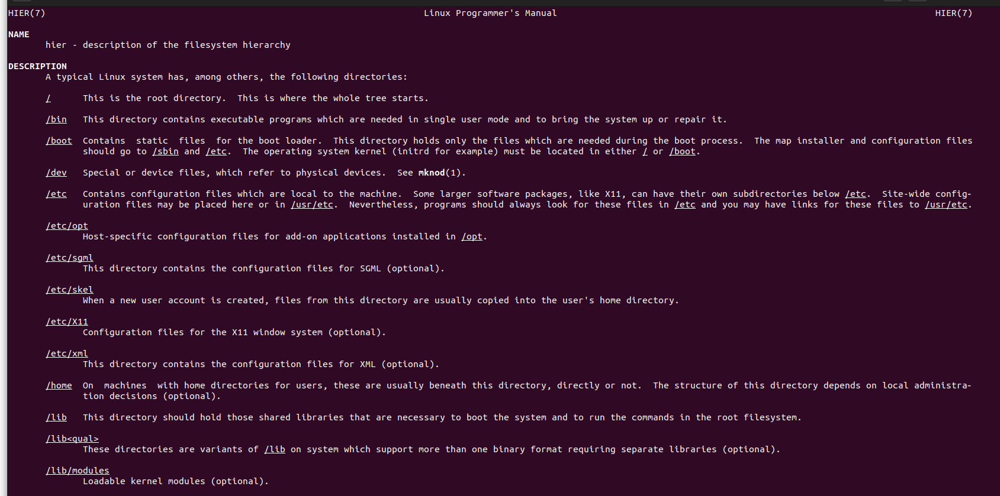

### The staging directory
```shell
$ mkdir ~/rootfs
$ cd ~/rootfs
$ mkdir bin dev etc home lib proc sbin sys tmp usr var
$ mkdir usr/bin usr/lib usr/sbin
$ mkdir -p var/log
```

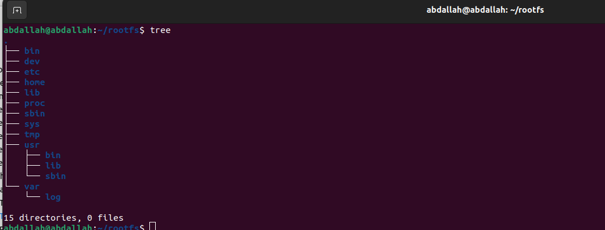

### POSIX file access permissions
1. **User and Groups:**  
   - Every program is associated with a user and one or more groups, identified by User ID (UID) and Group ID (GID) respectively.
   - The root user (UID 0) and root group (GID 0) have extensive system access.

2. **File and Directory Ownership:**  
   - Each file/directory has an owner and belongs to a group.
   - Access to files/directories is controlled by permission flags - read (r), write (w), execute (x) - arranged in 3 sets for owner, group, and others.

3. **Special Octal Digits:**  
   - An additional octal digit has special significance:
     - SUID (4): Sets the effective UID of the process to the owner of the file when executed.
     - SGID (2): Sets the effective GID of the process to the group of the file when executed.
     - Sticky (1): In directories, prevents users from deleting files owned by others (commonly set on /tmp and /var/tmp).

4. **Usage of SUID:**  
   - SUID often grants non-root users temporary superuser privileges for specific tasks.
   - Example: The ping program is owned by root and has SUID set, allowing normal users to execute it with superuser privileges temporarily.

5. **Setting Leading Octal Digits:**  
   - Use `chmod` command with values 4, 2, or 1 to set SUID, SGID, or Sticky bit respectively.
   - Example: To set SUID on /bin/ping: `sudo chmod 4755 bin/ping`
```shell
$ cd ~/rootfs
$ ls -l bin/ping
```
-rwxr-xr-x 1 root root 35712 Feb 6 09:15 bin/ping
```shell
$ sudo chmod 4755 bin/ping
$ ls -l bin/ping
```
-rwsr-xr-x 1 root root 35712 Feb 6 09:15 bin/ping

6. **Visual Indication of SUID:**  
   - After setting SUID, the permission bits display an 's' in place of 'x' for the owner, indicating the SUID bit is set.

Understanding and managing these permission bits allows for controlled access and security within a Linux-based system.

### File ownership permissions in the staging directory

There is a problem with the staging directory though. The files you create there will be
owned by you, but when they are installed on the device, they should belong to specific
owners and groups, mostly the root user. An obvious fix is to change the ownership to
root at this stage with the commands shown here:
```shell
$ cd ~/rootfs
$ sudo chown -R root:root *
```

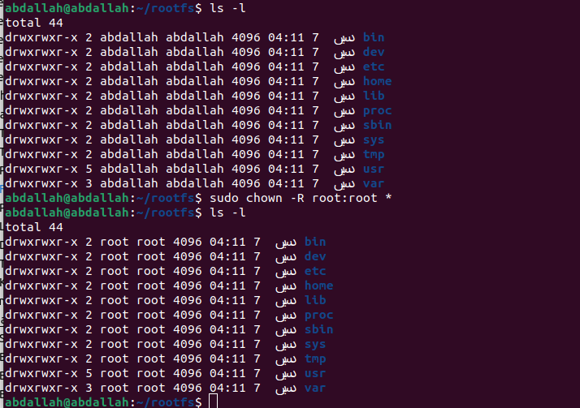


### Building BusyBox
1.Download Busybox
```shell
$ git clone git://busybox.net/busybox.git
$ cd busybox
```
2.Build busybox.
```shell
$ make distclean
make ARCH=arm64 CROSS_COMPILE=<prefix_toolchain> menuconfig 
make ARCH=arm64 CROSS_COMPILE=<prefix_toolchain>
```
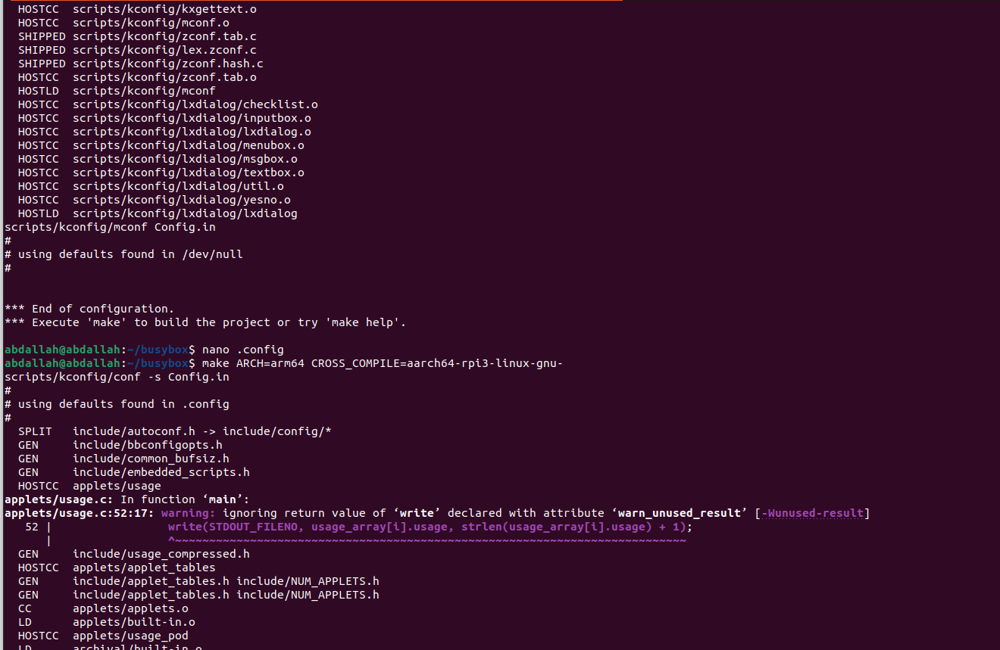

edit the CONFIG_PREFIX in .config file variable to be the path of the rootfs whitch we created before 

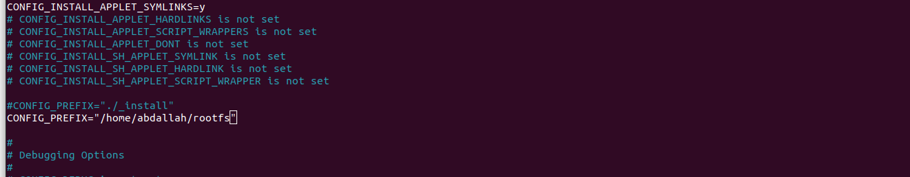


Setting CONFIG_PREFIX in BusyBox's .config to the rootfs path directs the installation of its utilities 
and files into the specified root directory during compilation

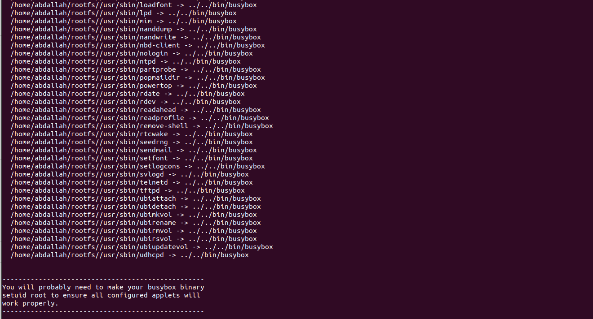


if we go to the rootfs , this is the output 

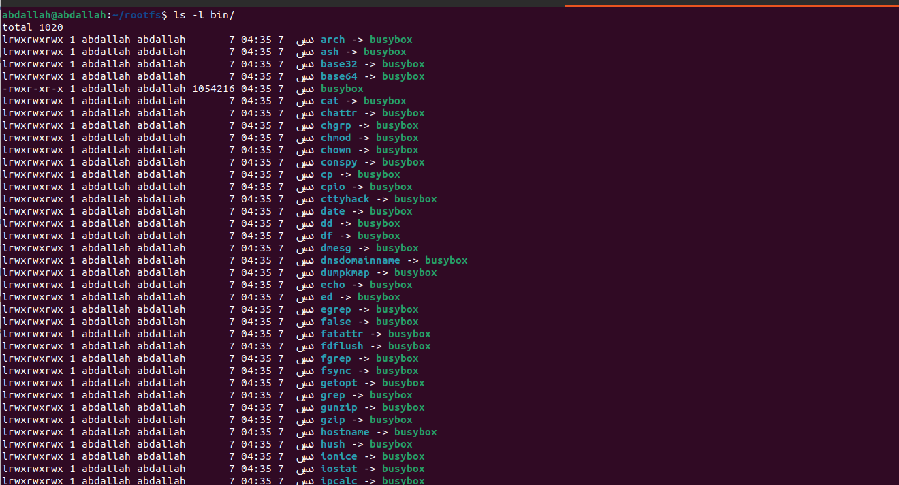

all the utilities are symbolic link to the busybox .
Symbolic links to the BusyBox binary allow multiple utilities to be represented by a single binary.

### Libraries for the root filesystem

Programs are linked with libraries. You could link them all statically, in which case, there
would be no libraries on the target device. But, this takes up an unnecessarily large amount
of storage if you have more than two or three programs. So, you need to copy shared
libraries from the toolchain to the staging directory. 

Merging sysroot with rootfilesystem using rsync.
```shell
$ cd ~/x-tools/
$ cd aarch64-rpi3-linux-gnu/aarch64-rpi3-linux-gnu
$ rsync -avh ./sysroot/ /home/abdallah/rootfs
```
rsync -avh /path/source /path/to/destination/

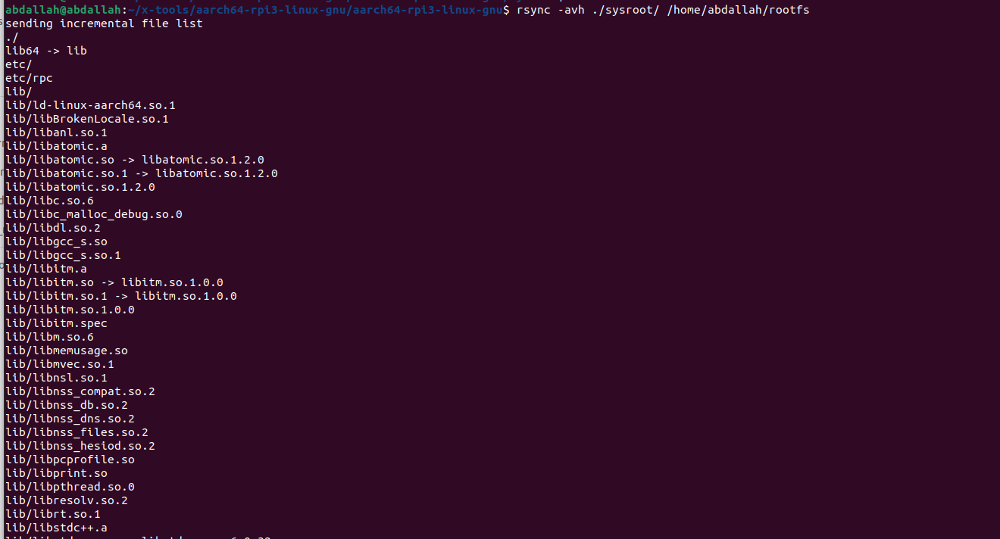
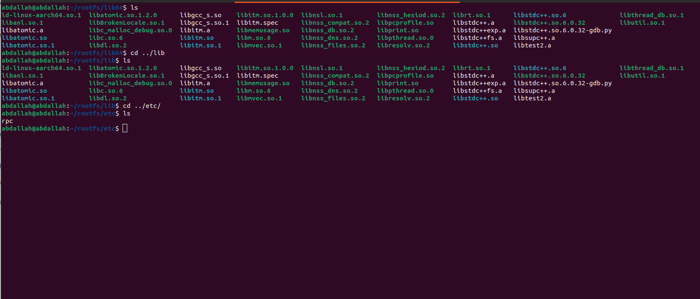


### c++ application

we will creat a c++ aplication 
```shell
$ cd ~/rootfs
$ sudo mkdir app
$ cd app
$ sudo nano main.cpp
```
```.cpp
#include <iostream>


int main(void)
{
        std::cout<<"this is a c++ application " <<std::endl;
        return 0;
}
```
### compile the c++ app by using aarch64-rpi3-linux-gnu-g++ croos compiler 

```shell
$ sudo -i
# cd /home/abdallah/rootfs/app/
# PATH=$PATH:/home/abdallah/x-tools/aarch64-rpi3-linux-gnu/bin
# aarch64-rpi3-linux-gnu-g++ main.cpp
# file a.out 
```
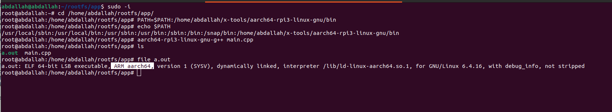

### Creating initramfs
```shell 
$ sudo -i
# cd /home/abdallah/rootfs/app/
# find . -print0 | cpio --null -ov --format=newc > initramfs.cpio
```
archives the contents of the current directory into a initramfs.cpio file in the cpio format, essential for creating an initial ramdisk for Linux booting.

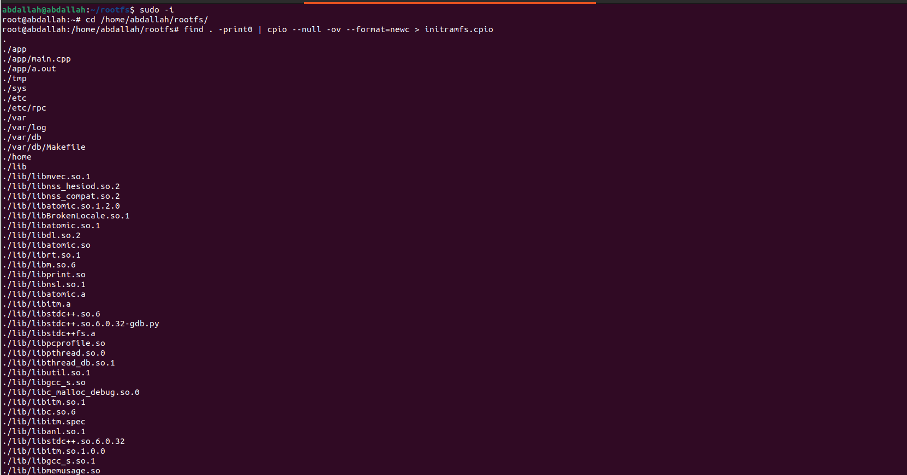
```shell 
# gzip initramfs.cpio
```
compress the initramfs.cpio file using gzip  , resulting in a compressed file named initramfs.cpio.gz.


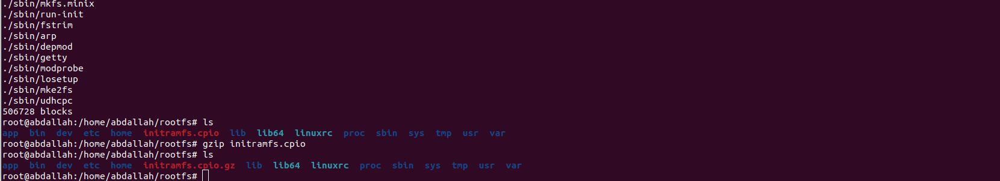

### Booting Kernel on qemu 
```shell 
$ qemu-system-aarch64 -M virt -cpu cortex-a53 -m 1G -kernel Image  -append "console=ttyAMA0 rdinit=/bin/sh" -initrd <initramfs> -nographic
```
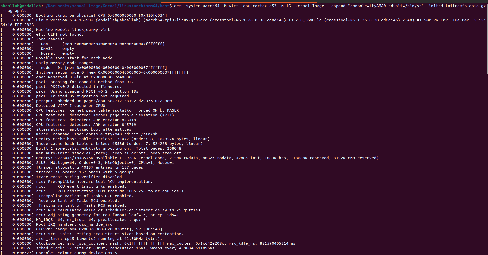
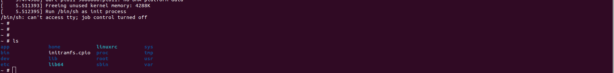
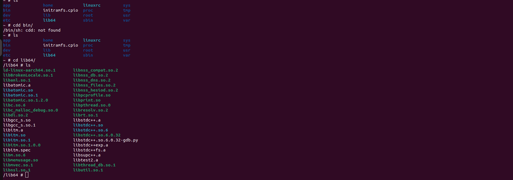


### run the c++ application 
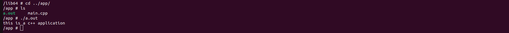


