# 1. Toolchain.

The toolchain is the first element of embedded Linux and the starting point of your project.
You will use it to compile all the code that will run on your device. 
required packages:fig(1)
autoconf, automake, bison, bzip2, cmake,
flex, g++, gawk, gcc, gettext, git, gperf, help2man, libncurses5-
dev, libstdc++6, libtool, libtool-bin, make, patch, python3-dev,
rsync, texinfo, unzip, wget, and xz-utils


```shell

$ sudo apt-get install autoconf automake bison bzip2 cmake 
$ sudo apt-get install flex g++ gawk gcc gettext git gperf 
$ sudo apt-get install help2man libncurses5-dev libstdc++6 
$ sudo apt-get install libtool libtool-bin make patch python3-dev 
$ sudo apt-get install rsync texinfo unzip wget xz-utils

```

Initially,we need to build three elements of an embedded Linux system:the bootloader,the kernel, and the root filesystem. 
GNU toolchain consists of four main components:

### 1.Binutils : 
A set of binary utilities including the assembler and the linker.
### 2.GNU Compiler Collection (GCC) :
These are the compilers for C and other languages,They all use a common backend that produces assembler code.
### 3.C library :
A standardized application program interface (API) based on the
POSIX specification, which is the main interface to the operating system kernel for applications.
### 4.Linux kernel headers :
contain definitions and constants that are needed when accessing the kernel directly. 
-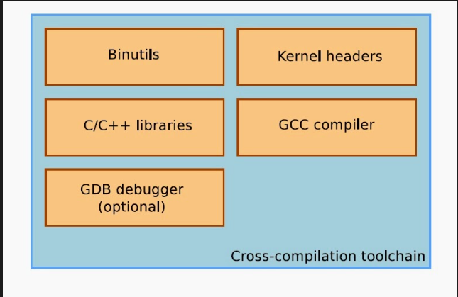


## Types of toolchains : 
### 1.Native toolchain :
Toolchain that generates code for the same Platform on which it runs. It converts high language into computer’s native language.
For example, Turbo C or GCC compiler. if a compiler runs on a Windows machine and produces executable code for Windows, then it is a native compiler.
### 2.Cross toolchain : 
Toolchain that generates executable code for a platform other than one on which the compiler is running. 
For example a compiler that running on Linux/x86 box is building a program which will run on a separate Arduino/ARM.
If a compiler runs on a Linux machine and produces executable code for Windows, then it is a cross compiler. 
-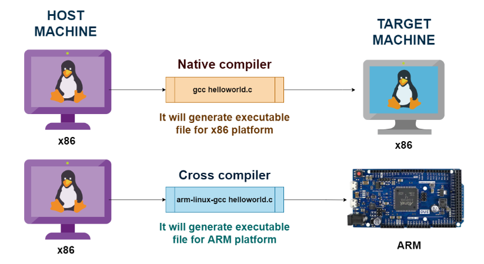
-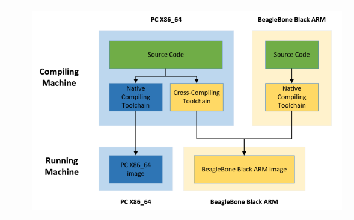

## Choosing the C library:
The programming interface to the Unix operating system is defined in the C language.
The C library needs the services of the kernel, it will use the kernel system call interface .
It is possible to bypass the C library by making the kernel system calls directly, but that is a lot of trouble and almost never necessary.
There are several C libraries to choose from. The main options are as follows:
### 1.glibc: This is the standard GNU C library
### 2.musl libc
### 3.uClibc-ng
### 4.uClibc-ng
-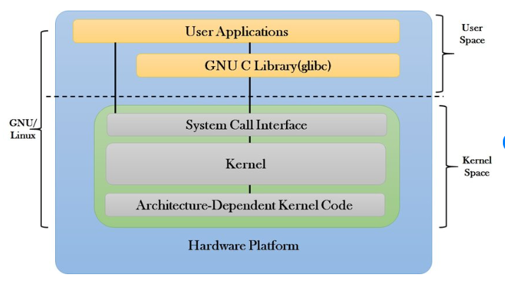


## Building a toolchain using crosstool-NG
### 1.Installing crosstool-NG

```shell 

$ git clone https://github.com/crosstool-ng/crosstool-ng.git
$ cd crosstool-ng
$ git checkout crosstool-ng-1.24.0
$ ./bootstrap
$ ./configure --prefix=${PWD}
$ make
$ make install

```

### 2.Building a toolchain

```shell 

$ bin/ct-ng distclean          		
$ bin/ct-ng list-samples       	
$ bin/ct-ng <choose sample>    		
$ bin/ct-ng show-aarch64-rpi3-linux-gnu 
$ bin/ct-ng menuconfig         
$ bin/ct-ng build 


```

### $ bin/ct-ng distclean :		
cleans up the Crosstool-NG build directory, removing any previously generated files and configurations.
-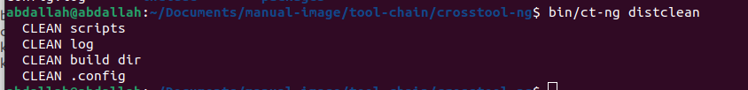
### $ bin/ct-ng list-samples :
Lists the available sample configurations that Crosstool-NG provides.
-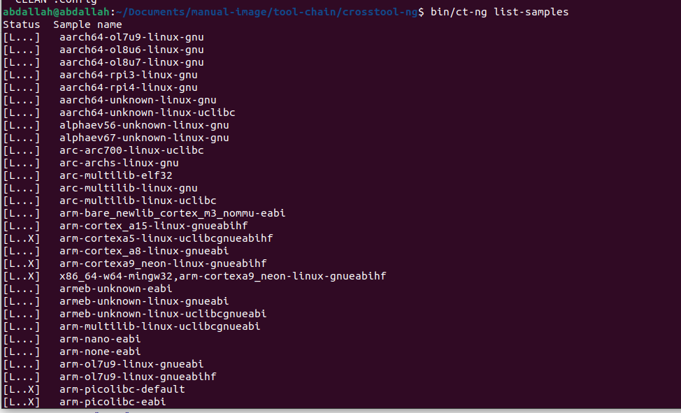
### $ bin/ct-ng <choose sample> : 
Selects a specific sample configuration from the available options.
-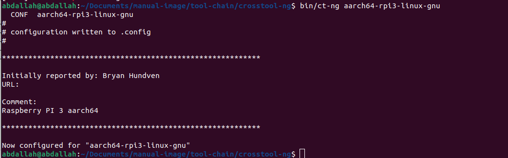
### $ bin/ct-ng show-aarch64-rpi3-linux-gnu : 
Show the default configuration.
-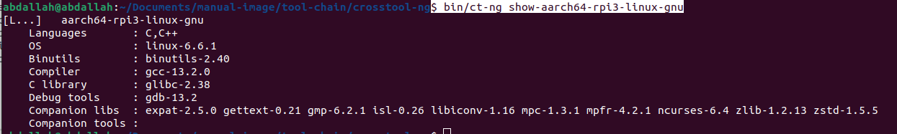
### $ bin/ct-ng menuconfig :        
opens the interactive configuration menu, allowing you to customize the selected toolchain configuration.
Here, you can enable or disable specific features, choose the target architecture, set optimization options, and modify various other settings.
-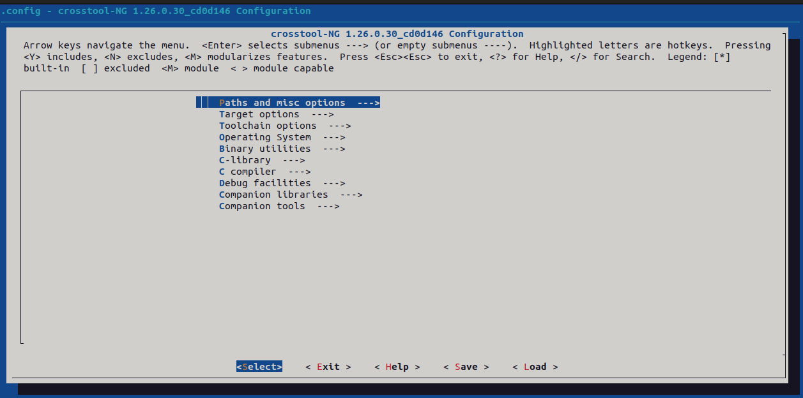
### $ bin/ct-ng build : 
Initiates the build process based on the selected or customized configuration.
Crosstool-NG will download, compile, and assemble all the necessary components to create the final cross-compilation toolchain for your target system.


After building the toolchain using Crosstool-NG, the resulting directory structure at ~/x-tool/ typically consists of two major types of directories:

1.For the host: These directories include bin, build.log.bz2, etc, include, and lib. They contain the necessary tools and resources for generating executables targeting the specific host system. This includes compilers, libraries, header files, and other related files.
-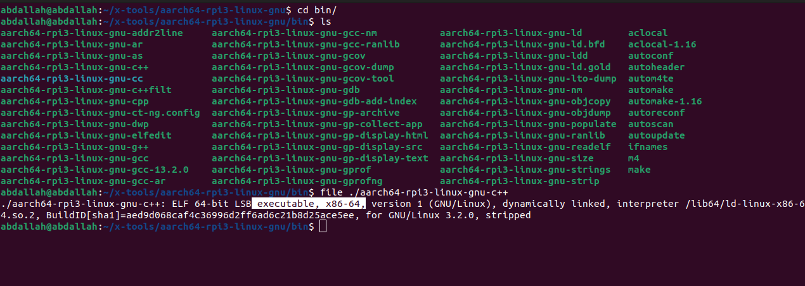
2.for the target : aarch64-rpi3-linux-gnu This directory represents the target architecture, which in this case is "aarch64" for the ARMv8 64-bit architecture, and "rpi3-linux-gnu" for the Linux operating system on the Raspberry Pi 3.
It contains subdirectories that mirror the root file system of the target device. These subdirectories provide the necessary files and resources needed by the compiler to generate executables specifically for the target platform.
-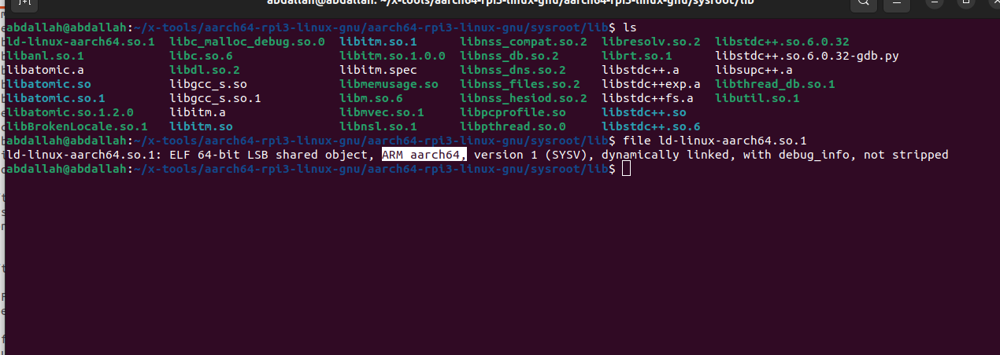
The toolchain, consisting of both the host and target components, enables the development and compilation of software on a host system that can be executed on the target system with the specified architecture and operating system.

```shell

aarch64-rpi3-linux-gnu-gcc -v

```
-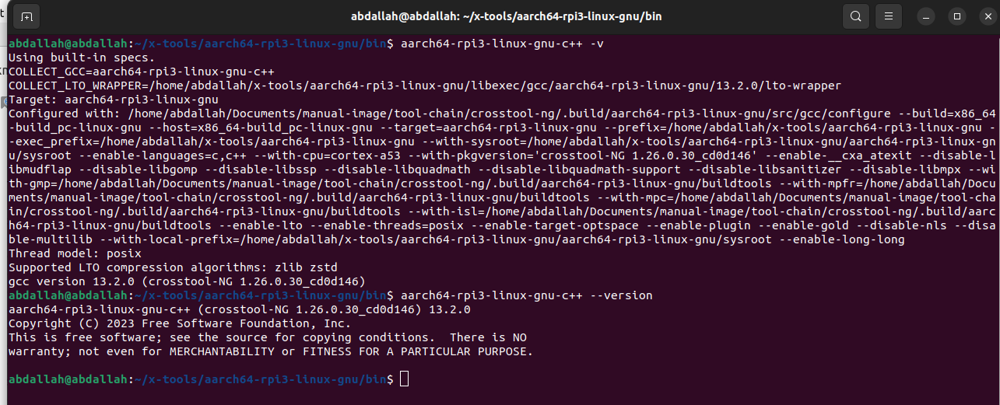
### --host=x86_64-build_pc-linux-gnu  
### --target=aarch64-rpi3-linux-gnu
### --with-sysroot=/home/abdallah/x-tools/aarch64-rpi3-linux-gnu/aarch64-rpi3-linux-gnu/sysroot  :   
This is the default sysroot directory
### --enable-languages=c,c++ :
Using this, we have both C and C++ languages enabled.
### --with-cpu=cortex-a53 :
The code is generated for an ARM Cortex A53 core.
### --enable-threads=posix : 
This enables the POSIX threads.


## Linking with libraries – static and dynamic linking 

Linking with libraries refers to the process of combining external library code with the application code to create a complete executable program.
Static linking involves including the library code directly into the executable, resulting in a standalone and independent executable.
Dynamic linking involves referencing external libraries at runtime, allowing multiple programs to share the same library code.
Static linking provides portability and independence but may result in larger executable sizes.
Dynamic linking offers flexibility and memory savings by sharing library resources but requires the presence of the corresponding libraries during runtime.

### 1.static linking :

```shell

$ aarch64-rpi3-linux-gnu-gcc -c print.c
$ aarch64-rpi3-linux-gnu-ar rc libprint.a print.o
$ aarch64-rpi3-linux-gnu-gcc -print-sysroot 
$ sudo cp libprint.a /home/abdallah/x-tools/aarch64-rpi3-linux-gnu/aarch64-rpi3-linux-gnu/sysroot/lib64
$ rpi-gcc main.c -lprint
$ file a.out 

```
-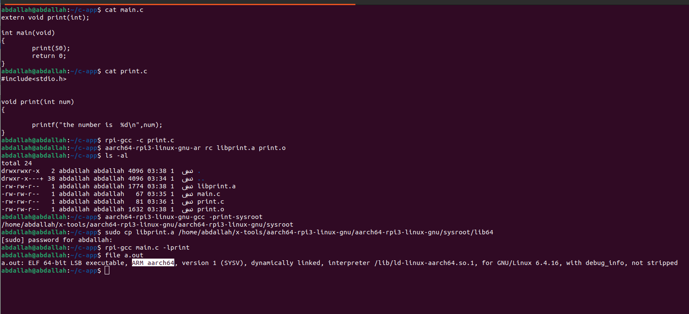
note that rpi3-gcc is just alias name to aarch64-rpi3-linux-gnu-gcc

### 2.dynamic linking 

```shell

$ rpi-gcc -fPIC -c print.c
$ rpi-gcc -shared -o libprint.so print.o
$ sudo cp libprint.so /home/abdallah/x-tools/aarch64-rpi3-linux-gnu/aarch64-rpi3-linux-gnu/sysroot/lib64
$ rpi-gcc main.c -lprint
$ file a.out 

```


-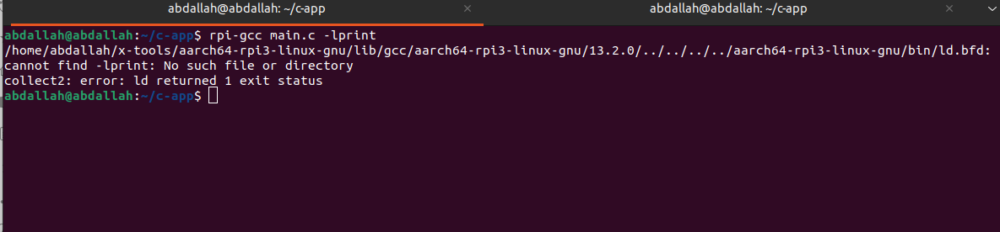


